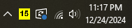

# WinpISSStream

A Windows system tray icon that shows how full the International Space Station urine tank is in real time.

[Download Now!](https://github.com/grantshandy/WinpISSStream/releases/download/v1.0/WinpISSStream.exe)

Windows Defender will likely think this is a malicious program, so you will probably have to add it to the [exclusions list](https://support.microsoft.com/en-us/windows/add-an-exclusion-to-windows-security-811816c0-4dfd-af4a-47e4-c301afe13b26).

This is a port of [pISSStream](https://github.com/Jaennaet/pISSStream) to .NET, written in one hour.